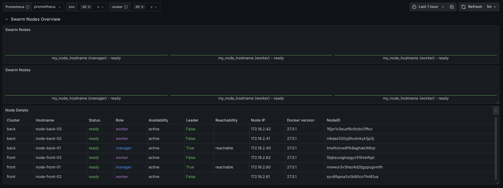
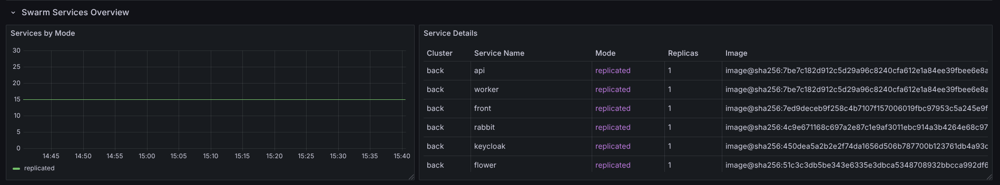
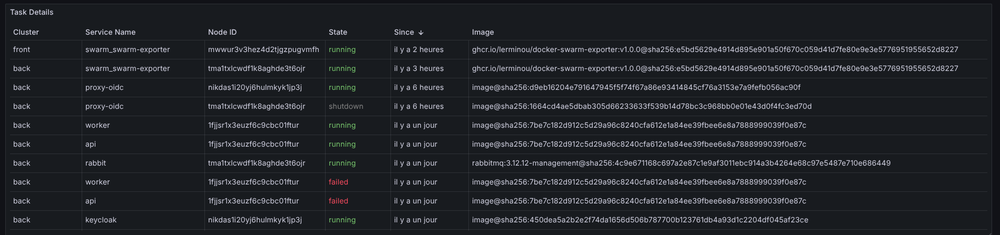

# Docker Swarm exporter (Docker Swarm)

[](https://github.com/lerminou/docker-swarm-exporter/pkgs/container/docker-swarm-exporter)
[](https://github.com/lerminou/docker-swarm-exporter/pkgs/container/docker-swarm-exporter)
[](https://github.com/lerminou/docker-swarm-exporter/actions/workflows/docker-publish.yml)
[](https://github.com/lerminou/docker-swarm-exporter/blob/master/LICENSE)

## Why Docker Swarm Exporter?

Docker Swarm Exporter provides a centralized monitoring solution for your externals Docker Swarm clusters without compromising security.    
By deploying a single instance of this exporter on a Swarm manager node, you can collect metrics from your entire cluster without needing to install a Prometheus agent on each cluster.     

This approach offers several advantages:

- **Simplified Architecture**: Eliminates the need for multiple Prometheus instances
- **Enhanced Security**: Accesses Docker metrics through a read-only mount of the Docker socket without exposing the Docker daemon API to external networks
- **Centralized Monitoring**: Collects and exposes metrics from all nodes, services, and tasks in your Swarm from a single endpoint

*Docker Swarm exporter* exposes information about the Docker Swarm it is running inside of.
Needs to be deployed to a manager.

The following metrics are supported:
- docker_swarm_node
- docker_swarm_service
- docker_swarm_task

## Grafana Dashboard

A Grafana dashboard is included in this repository to help you visualize your Docker Swarm metrics. The dashboard provides:

- Overview of all Swarm nodes with their roles and status
- List of all services with their deployment mode and replica count
- Distribution of tasks across nodes
- Detailed tables for nodes, services, and tasks

To use the dashboard:

1. Import the `grafana-dashboard.json` file into your Grafana instance
2. Configure the Prometheus data source that scrapes the Docker Swarm exporter
3. Enjoy a comprehensive view of your Docker Swarm cluster!

Nodes:

Services: 

Tasks:


## Metrics Details

### Metrics Overview

| Metric Name | Type | Description |
|-------------|------|-------------|
| docker_swarm_node | Counter | Provides information about Docker Swarm nodes |
| docker_swarm_service | Gauge | Provides information about Docker Swarm services |
| docker_swarm_task | Gauge | Provides information about Docker Swarm tasks |

### docker_swarm_node Labels

| Label | Description |
|-------|-------------|
| docker_swarm_node_id | Unique identifier of the node |
| docker_swarm_node_spec_role | Role of the node (manager or worker) |
| docker_swarm_node_spec_availability | Availability of the node (active, pause, or drain) |
| docker_swarm_node_description_hostname | Hostname of the node |
| docker_swarm_node_description_platform_architecture | Architecture of the node platform |
| docker_swarm_node_description_platform_os | Operating system of the node |
| docker_swarm_node_description_engine_engineversion | Docker Engine version running on the node |
| docker_swarm_node_status_state | Current state of the node (ready, down, etc.) |
| docker_swarm_node_status_addr | Address of the node |
| docker_swarm_node_managerstatus_leader | Whether the node is the swarm leader (true/false) |
| docker_swarm_node_managerstatus_reachability | Reachability status of the manager node |
| docker_swarm_node_managerstatus_addr | Address used for manager communication |

### docker_swarm_service Labels

| Label | Description |
|-------|-------------|
| docker_swarm_service_id | Unique identifier of the service |
| docker_swarm_service_name | Name of the service |
| docker_swarm_service_version | Version of the service |
| docker_swarm_service_created_at | Timestamp when the service was created |
| docker_swarm_service_updated_at | Timestamp when the service was last updated |
| docker_swarm_service_mode | Deployment mode of the service (replicated or global) |
| docker_swarm_service_replicas | Number of replicas for the service (or -1 for global mode) |
| docker_swarm_service_image | Docker image used by the service |

### docker_swarm_task Labels

| Label | Description |
|-------|-------------|
| docker_swarm_task_id | Unique identifier of the task |
| docker_swarm_task_name | Name of the task |
| docker_swarm_task_service_id | ID of the service this task belongs to |
| docker_swarm_task_service_name | Name of the service this task belongs to |
| docker_swarm_task_node_id | ID of the node this task is running on |
| docker_swarm_task_state | Current state of the task (running, failed, etc.) |
| docker_swarm_task_desired_state | Desired state of the task |
| docker_swarm_task_created_at | Timestamp when the task was created |
| docker_swarm_task_updated_at | Timestamp when the task was last updated |
| docker_swarm_task_image | Docker image used by the task |

## GitHub Repository

This project is now available as an open source project on GitHub:
[https://github.com/lerminou/docker-swarm-exporter](https://github.com/lerminou/docker-swarm-exporter)

## Recent Updates

- Added monitoring for Docker Swarm services with the `docker_swarm_service` metric
- Added monitoring for Docker Swarm tasks with the `docker_swarm_task` metric
- Updated dependencies to the latest versions
- Fixed issues with the Docker SDK for Python API changes
- Added Docker Compose file for easier testing
- Added Grafana dashboard for visualizing Docker Swarm metrics

## Use in a Docker Swarm deployment

Deploy:

```yaml
version: "3.8"

services:
  docker-swarm-exporter:
    image: ghcr.io/lerminou/docker-swarm-exporter:v1.0.0
    volumes:
      - /var/run/docker.sock:/var/run/docker.sock:ro
    deploy:
      mode: replicated
      replicas: 1
      resources:
        limits:
          memory: 50M
        reservations:
          memory: 20M
      placement:
        constraints:
          - node.role==manager
```

prometheus.yml

```yaml
# ...

- job_name: "swarm"
  static_configs:
    - targets:
        - "10.10.10.10:9456" # your swarm cluster ip
      labels: # Add your labels for your cluster here; at minimum, include these ones for a functional Grafana dashboard.
        env: prod
        swarm: back

```

sample rules:

```yaml
# ...
  - alert: node_down
    expr: rate(docker_swarm_node_total{docker_swarm_node_status_state!='ready'}[60s]) > 0
    for: 5m
    labels:
      severity: critical
    annotations:
      description: Node {{ $labels.docker_swarm_node_description_hostname }} seems to be down.
      summary: Node {{ $labels.docker_swarm_node_description_hostname }} seems to be down.

  - alert: manager_not_reachable
    expr: rate(docker_swarm_node_total{docker_swarm_node_spec_role='manager', docker_swarm_node_managerstatus_reachability!="reachable"}[60s]) > 0
    for: 5m
    labels:
      severity: critical
    annotations:
      description: Manager {{ $labels.docker_swarm_node_description_hostname }} is not reachable.
      summary: Manager {{ $labels.docker_swarm_node_description_hostname }} is not reachable.

  - alert: service_down
    expr: absent(docker_swarm_service{docker_swarm_service_name="important-service"})
    for: 5m
    labels:
      severity: critical
    annotations:
      description: Service important-service is down.
      summary: Service important-service is down.

  - alert: task_failed
    expr: docker_swarm_task{docker_swarm_task_state="failed"}
    for: 5m
    labels:
      severity: warning
    annotations:
      description: Task {{ $labels.docker_swarm_task_name }} from service {{ $labels.docker_swarm_task_service_name }} has failed.
      summary: Task {{ $labels.docker_swarm_task_name }} has failed.
```

# Contributing
## Testing with Docker Compose

A Docker Compose file is included to help you test the swarm-exporter in a local Docker Swarm environment. The compose file creates:

1. The swarm-exporter service that monitors the Docker Swarm
2. A simple Python test service that runs `sleep infinity` (2 replicas)

### Prerequisites

- Docker with Swarm mode enabled (`docker swarm init`)

### Deployment

```bash
# Navigate to the docker-swarm-exporter directory
cd docker-swarm-exporter

# Deploy the stack
docker stack deploy -c docker-compose.yml swarm-test

# Check the services
docker service ls

# Access the metrics
curl http://localhost:9000/metrics
```

### Cleanup

```bash
# Remove the stack when done
docker stack rm swarm-test
```
